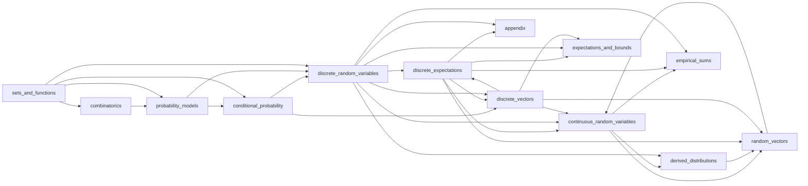

# Concept Map

*Auto-generated by `just concept md`. Do not edit by hand — edit the `introduces:` / `requires:` frontmatter in the chapter sidecars and re-run.*

## Reading order

1. `preface`
2. `sets_and_functions`
3. `combinatorics`
4. `probability_models`
5. `conditional_probability`
6. `discrete_random_variables`
7. `discrete_expectations`
8. `discrete_vectors`
9. `continuous_random_variables`
10. `derived_distributions`
11. `expectations_and_bounds`
12. `random_vectors`
13. `empirical_sums`
14. `appendix` (parked)
15. `appendix_background` (parked)

## Dependency graph

## Forward references

- `continuous_random_variables` requires `joint-pdf`, introduced later in `random_vectors`
- `discrete_expectations` requires `convolution`, introduced later in `discrete_vectors`
- `discrete_expectations` requires `independence-of-rvs`, introduced later in `discrete_vectors`

## Undefined concepts

None.

## Aliasing / redundancy

- `binomial-theorem` introduced by `appendix_background`, `combinatorics`
